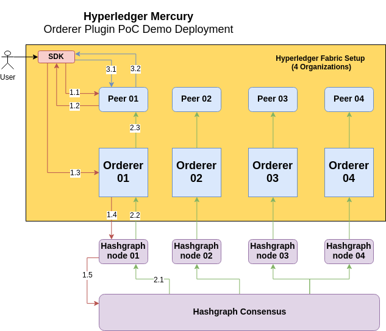

# Component Diagram



# Steps to run

This sections describes all the steps that are necessary to launch a Hyperledger Fabric instance (as seen in the diagram above) with a modified Orderer Service that connects to a Swirlds nodes cluster and benefits from Hashgraph's consensus (and ordering) for the transactions that are submitted to Hyperledger peers.

### 1. Install fabric

1.1 Prerequisites
Follow the instructions on Hyperledger page to install Docker, Docker Compose and Go Programing Language.
https://hyperledger-fabric.readthedocs.io/en/release-1.1/prereqs.html


1.2 Clone forked fabric to go src dir
```
cd $GOPATH/src
mkdir -p github.com/hyperledger
cd github.com/hyperledger/
git clone git@github.com:hyperledger/fabric.git
cd fabric/
```

Point the fabric repo to the forked version that contains the changes necessary to run the hashgraph plugin: 
```
git remote add fork git@github.com:dappcoder/fabric.git
git checkout -b hashgraph-orderer-plugin fork/hashgraph-orderer-plugin
```

The reason we first clone the original (hyperledger) repo and then we switch to a branch in the fork is to not break the go import statements that use absolute file paths.

1.3 Build fabric
```
make clean native docker
```
This will build the docker images needed to run fabric nodes and the binaries that we will need later.

To check the docker images simply run
```
docker images
```

You can find the binaries in the build directory
```
ls -l build/bin
```

Add build/bin to your PATH environment variable.
On Linux add this to ~/.profile
```
export PATH=$GOPATH/src/github.com/hyperledger/fabric/build/bin:$PATH
source ~/.profile
```

### 2. Install fabric-samples
Fabric Samples' role in our case is to reuse some of the example scripts that are useful to perform a complete Fabric demployment.

2.1 Clone the repo
```
git clone git@github.com:dappcoder/fabric-samples.git
git checkout hashgraph-orderer-plugin
```

2.2 Swirlds SDK

Download and unzip the SDK to `fabric-samples/first-network/swirlds-sdk/`

```
cd fabric-samples/first-network/
wget https://www.swirlds.com/downloads/Swirlds%20SDK%20-%20version%2018.05.23.zip
unzip Swirlds\ SDK\ -\ version\ 18.05.23.zip -d swirlds-sdk/
```
### 3. Hashgraph DApp

3,1 Clone Hyperledger Mercury app
```
git clone git@github.com:hashgraph/hl-mercury.git
```

3.2 Go to the maven module directory
```
cd hl-mercury/orderer-plugin-poc/hashgraph4orderer/
```

Change the `sdk.dir` property in the `pom.xml` file to point to the location you unziped the Swirlds' SDK in.

For example:
```
<sdk.dir>/home/dappcoder/fabric-samples/first-network/swirlds-sdk/sdk</sdk.dir>
```

3.3 Build it 
```
mvn clean install
```

### 4. Launch
4.1 Go back to `fabric-samples/first-network`.

4.2 Start both the Hyperledger and the Hashgraph networks and perform an end-to-end test.

```
./byfn.sh up
```

First, this last script spins up the necessary hyperledger and hashgraph nodes and then it installs a sample chaincode and runs a test request (query). 
